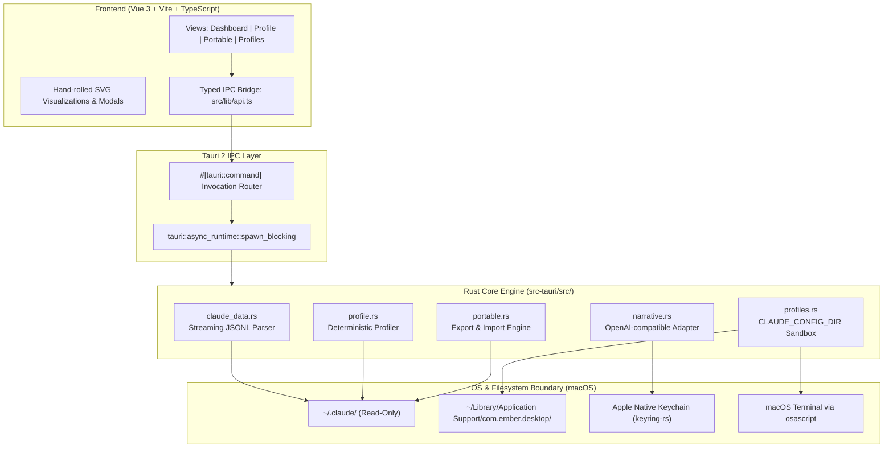

<!-- Slide 1 -->
# Project Ember
## Local-First Architecture, Profiling Heuristics & Config Sandboxing for Claude Code

**A Technical Architecture & Engineering Deep-Dive**

**Presenter:** Jisu Lee  
**Tech Stack:** Tauri 2 (Rust) + Vue 3 + TypeScript + Vite  
**Platform:** macOS Native (Local-First, Zero-Telemetry)

<!-- Speaker Notes:
Welcome everyone. Today we are presenting Project Ember.
Ember is a local-first desktop application designed to inspect, analyze, and safely manage local Claude Code workspaces and telemetry.
Throughout this presentation, we'll examine how Ember processes gigabytes of session JSONL transcripts on-device, how it synthesizes a deterministic style profile without relying on LLMs, how it coordinates isolated multi-config environments via AppleScript and environment variables, and the architectural lessons learned from building with Tauri 2 and Rust.
-->

---

<!-- Slide 2 -->
## The Problem Space: The Agentic CLI Blind Spot

### Key Operational Gaps in Terminal AI Workflows:

* **Telemetry Opacity:** Raw JSONL transcripts obscure token burn, cache hit rates, and tool costs.
* **Zero Portability:** Custom skills, rules (`CLAUDE.md`), and settings are trapped on one workstation.
* **Configuration Drift:** Experimenting with permission modes or plugins risks polluting `~/.claude`.
* **Privacy Risks:** Cloud analytics upload proprietary prompts, codebase paths, and source code.

> **Ember's Mandate:** Deliver local-first visibility, profile portability, and config sandboxing with **zero network egress**.

<!-- Speaker Notes:
When working with AI coding tools in the CLI, developers produce huge amounts of session data that are currently hidden away in raw JSONL files.
Most people have no idea how effectively their prompt caching is working, how many tokens they're consuming, or what their working rhythm looks like.
Furthermore, if you want to switch between different permission modes or isolated configs—for example, one profile for autonomous refactoring and another for restricted code review—you have to manually edit configuration files.
Ember solves this with a zero-leak, local-first architecture.
-->

---

<!-- Slide 3 -->
## System Architecture Overview

### Hybrid Native IPC via Tauri 2



<!-- Speaker Notes:
Here is Ember's high-level architecture.
On the frontend, we use Vue 3 with TypeScript, rendered inside a native macOS WebKit view via Tauri 2. Notice that we intentionally avoid heavy third-party chart libraries: all visualizations are hand-rolled SVGs for minimal bundle size and instantaneous renders.
The IPC layer communicates with the Rust backend via typed DTOs sharing snake_case parity.
Crucially, all file scans and computationally intensive tasks run on Tauri's blocking threadpool via spawn_blocking, keeping the UI thread at a silky 60 FPS.
Notice the security boundary: ~/.claude is strictly read-only for analytics, and credentials never cross the bridge.
-->

---

<!-- Slide 4 -->
## Fast Data Ingestion Engine (`claude_data.rs`)

### High-Throughput Streaming Transcript Parser

* **Single-Pass Aggregation (`scan_all`):**
  Traverses `~/.claude/projects/*/*.jsonl` once, accumulating tokens, models, and tools into a single in-memory `Scan` struct.
* **Lenient Schema Deserialization:**
  Extracts only necessary keys (`sessionId`, `timestamp`, `permissionMode`, `message`); unrecognized lines are silently ignored with zero overhead.
* **Comprehensive Metrics Extracted:**
  Tokens (Input, Output, Cache Read/Write), tools (`Edit`, `Read`, `Grep`, `Glob`), models, and prompt statistics.

> **Performance:** Parses hundreds of sessions and gigabytes of JSONL on a background threadpool (`spawn_blocking`) in under a second.

<!-- Speaker Notes:
Let's zoom into the data ingestion layer in claude_data.rs.
Users who use Claude Code heavily can easily accumulate tens of thousands of lines of transcripts across hundreds of session files.
Running separate parsing passes for the usage dashboard and the style profile would result in disk thrashing.
Instead, Ember uses a unified Scan accumulator populated during a single filesystem walk.
By using serde with Option fields and discarding unrecognized properties, parsing is both fault-tolerant against CLI schema updates and extremely fast.
-->

---

<!-- Slide 5 -->
## Style Profiling & Heuristics (`profile.rs`)

### Determinism Over Hallucination: Why Not Prompt an LLM?

Ember derives working-style traits **100% deterministically in Rust** for zero latency, zero cost, and byte-identical reproducibility:

| Trait Dimension | Naive Calculation (Flawed) | Ember's Heuristic Solution |
| :--- | :--- | :--- |
| **Session Length** | `last_ts - first_ts` $\rightarrow$ **75 hrs!** | Sum message gaps $\le 30\text{ min}$ (filters idle pauses) |
| **Prompt Length** | Arithmetic Mean (skewed by logs) | **Median** word count (immune to paste outliers) |
| **Autonomy Level** | First mode encountered | Proportional mode share (`auto`, `plan`, `accept`) |

> **Key Takeaway:** Real-world metrics are heavy-tailed; medians and idle-gap filtering prevent massive classification distortion.

<!-- Speaker Notes:
One of our core architectural principles is: don't use generative AI where deterministic math is superior.
If you ask an LLM to profile a user, it will hallucinate traits and vary between runs.
Instead, profile.rs computes statistical indicators directly.
Look at the session length metric in this table: early in development, session duration was computed as last timestamp minus first timestamp. Because Claude Code sessions persist across terminal restarts, someone leaving their laptop open overnight registered as a 75-hour marathon session!
Ember fixes this by computing active working time using a 30-minute idle threshold window.
Similarly, prompt length is classified using the median rather than the mean, because log dumps heavily skew the average.
-->

---

<!-- Slide 6 -->
## Archetype Taxonomy & Domain Detection

### Formula: `The {Autonomy} {Domain} {Tooling}`

Three independent vectors synthesize a deterministic developer archetype:

| Vector | Classification Heuristic | Possible Verdicts |
| :--- | :--- | :--- |
| **Autonomy** | Share of `auto` vs `plan` mode | *Hands-off* ($\ge 50\%$), *Methodical* ($\ge 30\%$), *Balanced* |
| **Domain** | Top non-doc file extensions | *Rust*, *TypeScript*, *Python*, *Jupyter*, *Markdown*, *LaTeX*, *Terraform* |
| **Tooling** | Edits (`Write/Edit`) vs Reads (`Read/Grep`) | *Builder* (Edits > Reads) or *Explorer* (Reads $\ge$ Edits) |

> **Result Examples:** *"The Methodical Markdown Explorer"*, *"The Hands-off Rust Builder"*, *"The Balanced Jupyter Builder"*.

<!-- Speaker Notes:
Every developer gets an archetype title based on a 3-dimensional orthogonal vector:
First, Autonomy: Are you hands-off, letting the agent auto-execute, or methodical, spending time in plan mode?
Second, Domain: We mapped dozens of file extensions so that technical writers editing Markdown, data scientists using Jupyter, or DevOps engineers managing Terraform get recognized accurately.
Third, Working Mode: Do you spend more tool calls actively modifying code (Builder), or searching and inspecting existing architecture (Explorer)?
This creates an intuitive, delightful summary that accurately reflects developer workflow.
-->

---

<!-- Slide 7 -->
## Security Invariants & Zero-Knowledge Architecture

### Hardened Privacy by Design

* **Strict Filesystem Isolation (`~/.claude/`):**
  * `.credentials.json`: **Excluded & never accessed**.
  * `.claude.json`: Only whitelisted non-sensitive metadata (`numStartups`) is read; `oauthAccount`, `userID`, and API keys are silently discarded.
  * Transcripts (`projects/*/*.jsonl`): Processed in-memory in **read-only mode**.
* **Zero Network Egress for Core Features:**
  Dashboard and Profile computation never make external network calls.
* **macOS Keychain Isolation:**
  Cloud LLM tokens are stored in the system Keychain under `com.ember.desktop`, never in plain text on disk.

<!-- Speaker Notes:
Security is our paramount concern. Many developers use Claude Code on proprietary codebases.
We guarantee that Ember never uploads their code or credentials anywhere.
Transcripts are scanned locally in read-only mode.
Notice how we handle ~/.claude.json: serde is instructed to deserialize only metadata like startup counts. Sensitive fields like OAuth tokens or user IDs are completely ignored and never stored in memory.
Furthermore, credentials.json is never read or packaged in exports.
-->

---

<!-- Slide 8 -->
## Portable Profile Bundles (`portable.rs`)

### Cross-Machine Workstation Sync Without Credential Leakage

* **Export Pipeline:**
  Packages configuration (`skills/`, `settings.json`, `CLAUDE.md`) and the generated style profile (`profile.json` + `profile.md`).
* **Strict Asset Whitelisting:**
  Credentials (`.claude.json`, `.credentials.json`, OAuth tokens, API keys) are mathematically excluded from the export manifest.
* **Two-Phase Safe Import:**
  1. **Dry-Run Analysis:** `import_profile(apply = false)` generates a verified diff plan showing proposed changes.
  2. **Atomic Apply:** Writes to disk only upon explicit developer confirmation.

> **Result:** Carry custom skills and personas between machines safely without secret leakage.

<!-- Speaker Notes:
Developers frequently work across multiple machines—for example, a MacBook at home and an iMac at the office.
Project Ember introduces a Portable Profile Bundle.
When you export a bundle, Ember packages your style profile, your custom skills, your global CLAUDE.md, and your settings.
Credentials are mathematically excluded from the asset whitelist.
When importing on a new machine, Ember executes a dry-run first, showing the developer an exact manifest of files to be updated before touching the disk.
-->

---

<!-- Slide 9 -->
## Multi-Config Sandboxing & Terminal Orchestration

### Isolated Workspaces via `CLAUDE_CONFIG_DIR` (`profiles.rs`)

* **Sandbox Directory Isolation:**
  Profiles live in `~/Library/Application Support/com.ember.desktop/profiles/<id>/`. Each profile maintains independent `settings.json`, `CLAUDE.md`, and skills without modifying `~/.claude`.
* **In-App Configuration Editor:**
  Easily customize default model (Sonnet, Opus, Haiku), permission mode (`auto`, `plan`), and active plugins per profile.
* **Native AppleScript Terminal Launcher:**
  Ember generates an executable `launch.command` and invokes Terminal via `osascript`:
  `CLAUDE_CONFIG_DIR="/path/to/profile" exec claude`
* **Side-by-Side Execution:** Run multiple profiles concurrently in separate terminal windows.

<!-- Speaker Notes:
This is one of Ember's most powerful productivity features: multi-profile management.
Claude Code natively supports the CLAUDE_CONFIG_DIR environment variable to isolate configuration directories.
Ember manages these profiles in the app data directory. You can create profiles from scratch, clone existing ones, or import from a bundle.
You can adjust the default model, configure permission modes, toggle plugins, and edit CLAUDE.md.
When you click "Launch", Ember uses AppleScript via osascript to open native macOS Terminal tabs with the exact environment variables configured.
You can run multiple instances side-by-side without config collisions.
-->

---

<!-- Slide 10 -->
## Local-First LLM Narrative System (`narrative.rs`)

### Provider-Agnostic, Privacy-Preserving Prose Generation

* **Local-First Architecture:**
  Standard OpenAI-compatible REST adapter (`POST /chat/completions`) connecting seamlessly to **Ollama**, **oMLX**, **LM Studio**, or **llama.cpp** (`127.0.0.1`).
* **Grounded Metrics Input:**
  Only computed aggregate metrics (`StyleProfile`) are passed to the model—**raw transcripts, file contents, and credentials never touch the LLM**.
* **Defensive CoT Sanitization:**
  `clean_narrative()` strips `<think>` and `<thinking>` blocks emitted by reasoning models (DeepSeek-R1, Qwen) to prevent raw chain-of-thought leaking into the UI.
* **Zero-Leak Key Management:**
  Cloud API keys (if used) are stored exclusively in the macOS Keychain, never in config files.

<!-- Speaker Notes:
The narrative feature demonstrates our local-first philosophy in action.
Instead of binding tightly to a cloud API like Anthropic or OpenAI, Ember uses a generic OpenAI-compatible REST client.
This means you can point Ember directly at a locally running instance of Ollama, oMLX on Apple Silicon, or LM Studio. No data ever leaves your computer!
Furthermore, we built defensive post-processing: modern local models frequently output raw reasoning or think tags. Ember cleans these tags automatically and extracts only the polished narrative.
-->

---

<!-- Slide 11 -->
## macOS System Integration & Keychain Security

### Eliminating the "Keychain Spasm" Anti-Pattern

* **The Problem (Naive Polling):**
  Checking the Keychain on every Profile tab view triggered repeated, disruptive macOS system authorization dialogs.
* **Ember's Refined Architecture:**
  * Non-secret `llm.json` config tracks a boolean `has_api_key: bool`.
  * The UI queries this boolean flag with **zero Keychain reads** on view load.
  * The OS Keychain is accessed **only** on explicit "Save Key" or when running cloud generation.
* **Apple Native Security:**
  Uses `keyring` (`apple-native` feature) for hardware-backed macOS Keychain Services integration.

<!-- Speaker Notes:
During the development of the LLM narrative feature, we encountered an important UX hurdle:
Initially, whenever the Profile tab loaded, the backend checked the Keychain to determine if an API key existed.
On macOS, accessing the Keychain can trigger a system prompt asking the user for authorization. Opening the profile tab was causing repeated system dialogs!
We fixed this by maintaining a simple boolean flag, has_api_key, in the unencrypted config file.
The Keychain is now only touched when the user explicitly clicks 'Save Key' or initiates a generation with a cloud endpoint.
-->

---

<!-- Slide 12 -->
## Frontend Architecture & UI Design System

### Reactive Vue 3 + TypeScript Desktop Interface

* **Modular View Architecture:**
  * **Views:** `DashboardView` (usage analytics), `ProfileView` (archetype/traits), `PortableView` (bundles), `ProfilesView` (sandboxing).
  * **IPC Contract (`src/lib/api.ts`):** Strictly typed wrappers calling `invoke()` with snake_case DTO parity mirroring Rust backend structs.
* **Hand-Rolled SVG Visualizations (`Bars.vue`):**
  Zero-dependency SVG bar charts computed directly via Vue reactive templates—eliminates hundreds of kilobytes of heavy charting libraries.
* **WKWebView Modal Resilience (`NamePrompt.vue`):**
  macOS WebKit returns `null` on `window.prompt()`. Ember implements a native in-app modal to maintain reliable clone and rename flows.

<!-- Speaker Notes:
Looking at the frontend structure in src/:
Everything is modular, predictable, and typed.
Notice components like Bars.vue: rather than pulling in massive charting packages that slow down startup time, we render clean, responsive SVG bar charts directly using Vue template bindings.
Also note NamePrompt.vue: in macOS WebKit webviews, window.prompt returns null immediately without showing anything.
We caught this early in testing and replaced all native prompt calls with an in-app modal.
-->

---

<!-- Slide 13 -->
## Engineering Case Studies & Post-Mortems (`HISTORY.md`)

* **Tauri 2 Dev-Server Scaffolding Trap:**
  Scaffold hung indefinitely waiting on port 1420 without `beforeDevCommand`. Fixed by pinning `strictPort: true` in Vite and configuring automatic dev launching in `tauri.conf.json`.
* **The Deno 2.9 Detour (`ember-deno`):**
  Experimental sibling prototype exposed webview binding race conditions, missing Keychain support, and virtual bundle issues—validating Tauri 2's robust native foundation.
* **Demo Data Hygiene & Idempotency:**
  Non-idempotent test generator accumulated duplicate sessions, breaking vocabulary richness metrics. Resolved with strict directory wipes and multi-domain vocabulary expansion.

<!-- Speaker Notes:
One of the best artifacts in the Ember repository is HISTORY.md, which candidly documents architectural mistakes and fixes.
For instance, we actually built a complete parallel prototype using Deno 2.9's 'deno desktop' feature.
While Deno's single-language TypeScript proposition was intriguing, we ran into several undocumented rough edges: webview binding race conditions, bundling issues, and missing Keychain bindings.
Returning to Tauri 2 gave us direct access to Rust's apple-native crate and seamless process control.
-->

---

<!-- Slide 14 -->
## Performance & Resource Utilization

### Why Tauri 2 + Rust Outperforms Electron

| Metric / Dimension | Electron Alternative | Project Ember (Tauri 2 + Rust) | Advantage |
| :--- | :--- | :--- | :--- |
| **Binary Bundle Size** | ~120 MB - 180 MB | **~8 MB - 14 MB** | **>10x Smaller** |
| **Idle Memory Footprint** | ~150 MB - 300 MB | **~35 MB - 55 MB** | **~5x Less RAM** |
| **Cold Startup Time** | ~1.5s - 3.2s | **~300ms** | **Near Instant** |
| **Transcript Parsing** | JS Event Loop (Blocking) | **Rust OS Threadpool (`spawn_blocking`)** | **Zero UI Freezes** |
| **Secret Storage** | Plaintext config or node-keytar | **macOS Keychain Services (`keyring-rs`)** | **Hardware Encrypted** |

> *Tested on Apple Silicon (M-series), scanning 50MB+ across 800+ session transcripts.*

<!-- Speaker Notes:
When building a desktop utility that developers keep open alongside their IDE and terminal, resource footprint matters immensely.
An Electron app would package an entire Chromium browser and Node runtime, easily consuming 200 megabytes of memory at idle.
With Tauri 2, Ember leverages the system's native WebKit engine and compiles the backend directly to native ARM64 machine code.
The entire binary bundle is around 10 megabytes, it boots in 300 milliseconds, and background transcript scanning never drops frames on the frontend.
-->

---

<!-- Slide 15 -->
## Developer Workflow & Persona Simulation

### Testing Without Touching Real Data

Ember includes a Python persona generator (`scripts/gen_demo_data.py`) to simulate diverse developer profiles without risking personal privacy:

```bash
# Generate 5 synthetic personas & launch targeting Data Analyst
python3 scripts/gen_demo_data.py
HOME="$PWD/demo-data/data-analyst" ./src-tauri/target/release/bundle/macos/ember.app/Contents/MacOS/ember
```

* **Simulated Disciplines:**
  * **Engineering:** `frontend-dev` (UI/types), `devops-sre` (Terraform/k8s).
  * **Analytics & Research:** `data-analyst` (Jupyter/cohorts), `academic-researcher` (LaTeX).
  * **Documentation:** `technical-writer` (Markdown restructuring & style).

<!-- Speaker Notes:
How do you test and demo a tool whose entire premise is reading personal ~/.claude data without leaking your own private prompts?
We engineered scripts/gen_demo_data.py.
By overriding the HOME environment variable when launching the binary, Ember seamlessly reads synthetic transcripts.
This allowed us to test and screenshot 5 distinct personas—from Technical Writers to SREs—verifying that our stack detection and vocabulary heuristics behave correctly across distinct professions.
-->

---

<!-- Slide 16 -->
## Future Horizons & Roadmap

### What's Next for Project Ember?

* **Cross-Platform Terminal Spawners:**
  Port the terminal launch engine from AppleScript to cross-platform pseudoterminal (PTY) libraries or Windows Terminal / Linux ghostty/tmux integrations.
* **MCP (Model Context Protocol) Server Management:**
  Expand the Profiles tab to visually configure, test, and inject MCP server configurations into specific `CLAUDE_CONFIG_DIR` environments.
* **Team Style & Rule Syncing:**
  Allow engineering teams to export shared `ember-pack` bundles containing unified `CLAUDE.md` coding standards, linting skills, and recommended autonomy configurations.
* **Context Window Budgeting & Forecasting:**
  Analyze session transcript growth rates to predict when an active conversation is nearing context limits or excessive token re-caching.

<!-- Speaker Notes:
Looking forward, there are several exciting areas for Ember.
First, expanding beyond macOS: while the Keychain and AppleScript integrations were built first for macOS users, the core Rust data layer is fully cross-platform.
Second, visual Model Context Protocol (MCP) server management: allowing developers to assign specific MCP tools to specific profiles.
Third, team rule distribution: sharing vetted CLAUDE.md and skills packages across engineering organizations with one-click import verification.
-->

---

<!-- Slide 17 -->
## Summary & Key Architectural Principles

1. **Local-First, Always:**
   Your AI conversations contain proprietary code and thoughts. Ember keeps 100% of insights processing on-device.
2. **Determinism Before Generative AI:**
   Compute rigorous statistics and archetypes with algorithms, not LLMs. Use models only for creative prose, with local fallbacks.
3. **Safe Sandboxing Over In-Place Mutation:**
   Never mutate `~/.claude` unexpectedly. Isolate experimental configurations using `CLAUDE_CONFIG_DIR` and dry-run import plans.
4. **Lightweight Native Excellence:**
   Tauri 2 + Rust + Hand-rolled SVG delivers maximum responsiveness with minimal memory footprint.

<!-- Speaker Notes:
To summarize, Project Ember represents a blueprint for how modern developer tools should be built:
Local-first, respectful of privacy, deterministic by default, and lightweight.
By bridging native Rust performance with a modern Vue frontend, Ember provides deep observability into AI coding workflows without compromising security.
-->

---

<!-- Slide 18 -->
# Questions & Discussion

### Project Ember: Your Claude Code Usage, at a Glance.

* **Repository:** Local Workspace (`/ember`)
* **Documentation:** `README.md`, `CLAUDE.md`, `docs/HISTORY.md`
* **Design & Icons:** `design/icons/ICON.md`

```
  🔥 ember — Built with Rust, Tauri 2, and Vue 3
```

**Thank You!**

<!-- Speaker Notes:
Thank you all for your time.
I am happy to take any questions regarding the Rust data pipeline, the heuristic classification algorithms, or our experiences building on Tauri 2!
-->
